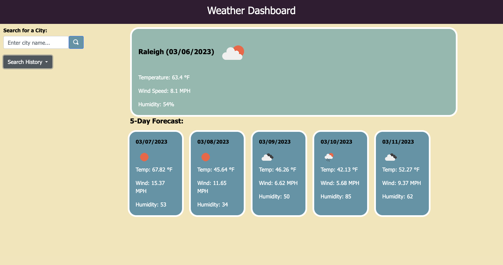

# Using Server-Side APIs: Weather Dashboard

## Link to Deployed Webpage 
To view the "Weather Dashboard" web application, please visit the following link: https://mackenzie-wentworth.github.io/weather-dashboard/

## The Task

This week I was challenged to create a "Weather Dashboard" web application that retrieves data from another server-side API. To complete this task, I had to build a code from scratch using an API key with the OpenWeather API and localStorage with JavaScript to produce a dynamically updated product of HTML and CSS. Per the requirements to develop the "Weather Dashboard," I made sure to include the following items:

* A 'search' form input that allows users to search for a particular city
* Once a user searches for a city, that city is saved to localStorage and added to a 'search history' list
* Upon searching for a city, the user is presented with the current and future weather conditions for that city
* When viewing the current weather conditions, the user is presented by a display of the city's name, date, weather icon, temperature, humidity, and wind speed
* When viewing future weather conditions, the user is presented by a 5-day forecast that displays the date, weather icon, temperature, humidity, and wind speed for each day
* When a user clicks on a city from the 'search history,' then they are presented by a display for that city's current and future weather conditions

## Mock-Up

The following image shows the appearance and functionality of the "Weather Dashboard" web application once a user searches for a city to display the current and future weather conditions:

## Credits

OpenWeather API: 5 Day Weather Forecast - https://openweathermap.org/forecast5